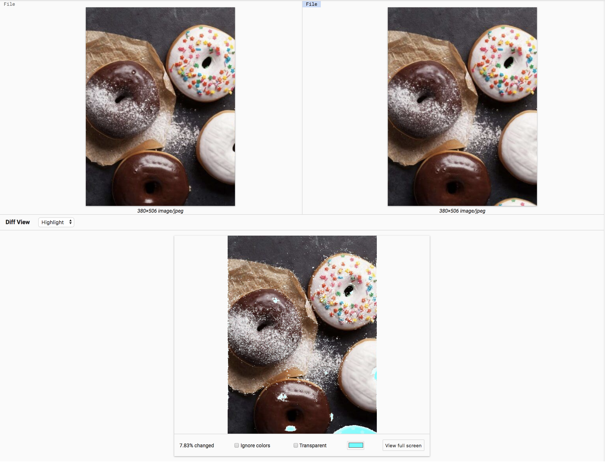
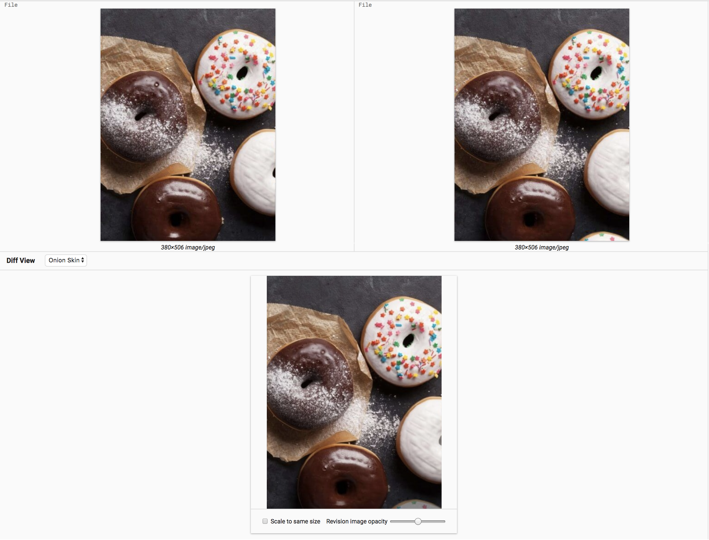

# Image Diff

A plugin that provides a rich image diffing experience in PolyGerrit.
Currently, the plugin features two modes: Highlight Mode and Onion Skin.

## Getting Started

These instructions will get you a copy of the project up and running on your local machine for development and testing purposes. See deployment for notes on how to deploy the project on a live system.

### Build

The build requires to be done from an existing Gerrit tree. All commands below are relative to the root of a copy of Gerrit.

1. Clone the `image-diff` repository into the `plugins` folder of the `gerrit` repo,
   or link the `image-diff` plugin folder to `gerrit/plugins` folder.
2. Override Gerrit `plugins/package.json` with the plugin package.json:
```
ln --symbolic --force image-diff/package.json plugins/package.json
```

You can remove all `depDependencies` from `plugins/package.json` as they are not needed for the build (they are only needed for running wct tests).

3. run `bazel build plugins/image-diff`

## Highlight Mode



This mode uses the [Resemble.JS](https://github.com/HuddleEng/Resemble.js?files=1) library.

The following features are included in this mode:

* Percentage of difference between the images
* Ability to ignore color in the comparison
* Ability to make the diff color more discernible
* Change the diff color
* View the diff in full screen

## Onion Skin



Onion Skin mode is a great way for users to notice changes in the images that might be overlooked when you look at them side by side. By overlaying the new image on top of the old image, the users can change the opacity to see the transition that were made.

The following features are included in this mode:

* Scale the new image to the same size as the old image
* Changing the opacity of the top image

## Testing

This plugin uses [polymer-cli](https://www.polymer-project.org/1.0/docs/tools/polymer-cli#install) to test.

Inside your image-diff repo, run `polymer serve` to start a local web server and open `localhost:8080/test` to view your tests. See [here](https://www.polymer-project.org/2.0/docs/tools/polymer-cli-commands#serve) for more info.

Or run `npm run wct-test` to run all your tests.

## Development

Reference [here](https://gerrit.googlesource.com/gerrit/+/master/polygerrit-ui/) on how to set up your Gerrit testsite and [here](https://gerrit-documentation.storage.googleapis.com/Documentation/2.15.3/pg-plugin-dev.html#loading) for PolyGerrit plugin development.

To update dependencies amend `package.json` then from the root of the Gerrit repository execute yarn to refresh the `yarn.lock` lock file:
```
bazel run @yarn//:yarn install -- --cwd plugins/image-diff install
git add package.json yarn.lock
```

Then since developers tend to use `npm` directly, refresh the `package-lock.json` as well:
```
npm update
```

Add `package.json`, `package-lock.json` and `yarn.lock` to your git commit.

## Authors

* Jack Zheng
* Raeggin Williams
* Kasper Nilsson
